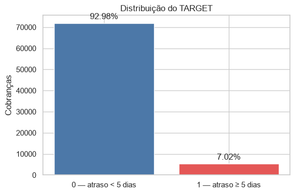
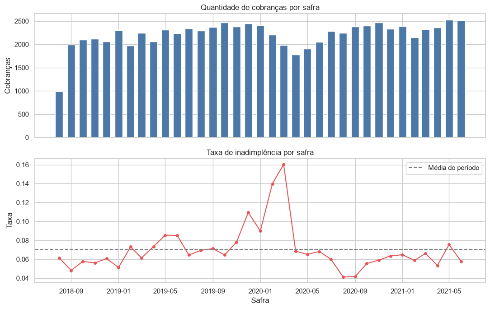
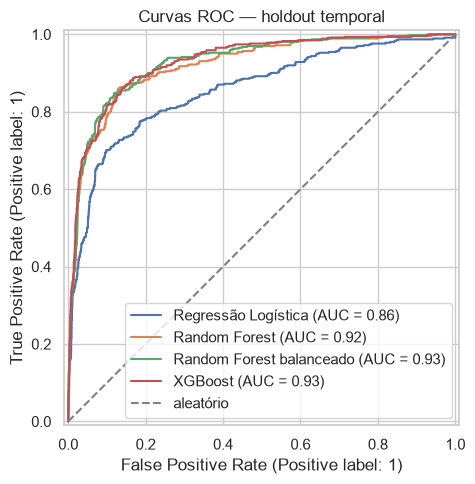
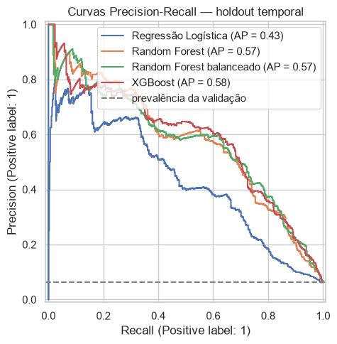
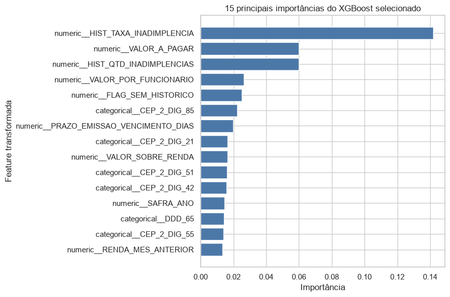
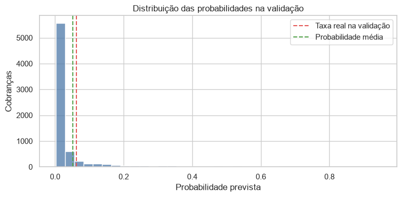

# Modelagem de Risco de Inadimplência — Datarisk

Modelo probabilístico para estimar, **por cobrança**, o risco de pagamento com atraso de **5 dias ou mais**.  
O projeto cobre o fluxo completo de um case de Data Science: validação das bases, EDA, engenharia de atributos, prevenção de *data leakage*, validação temporal, comparação de modelos e geração das probabilidades finais.

**Stack:** Python 3.12.5 · pandas · scikit-learn · XGBoost · Matplotlib · Seaborn · Jupyter

---

## Visão geral

O objetivo não é classificar uma cobrança como “boa” ou “ruim” a partir de um limiar arbitrário, mas estimar:

\[
P(\text{atraso} \geq 5\text{ dias} \mid \text{informações disponíveis no momento da cobrança})
\]

A unidade de previsão é **uma cobrança** e a saída é uma probabilidade contínua entre 0 e 1.

| Indicador | Resultado |
|---|---:|
| Cobranças no desenvolvimento | **77.414** |
| Clientes no desenvolvimento | **1.248** |
| Cobranças no teste | **12.275** |
| Taxa do evento no desenvolvimento | **7,02%** |
| Holdout temporal | **abr/2021 → jun/2021** |
| Modelo selecionado | **XGBoost** |
| ROC-AUC no holdout | **0,9291** |
| Log Loss no holdout | **0,1333** |
| Average Precision no holdout | **0,5808** |

> **Dados:** as bases originais e o enunciado/dicionário fornecidos no contexto do case não são redistribuídos neste repositório. O notebook documenta a estrutura esperada e todo o pipeline utilizado.

---

## O problema

A variável-alvo foi construída diretamente a partir das datas de pagamento e vencimento:

```text
DIAS_ATRASO = DATA_PAGAMENTO - DATA_VENCIMENTO

TARGET = 1  se DIAS_ATRASO >= 5
TARGET = 0  caso contrário
```

Foram incluídos testes explícitos para a fronteira da regra: 4 dias → 0; 5 e 6 dias → 1.

O desenvolvimento cobre **agosto de 2018 a junho de 2021**. A base de teste corresponde aos meses seguintes, de **julho a novembro de 2021**. Essa estrutura temporal foi determinante para a estratégia de validação.

---

## Pipeline

```mermaid
flowchart LR
    A[4 bases originais] --> B[Validação e merges]
    B --> C[Construção do target]
    C --> D[EDA]
    D --> E[Engenharia de atributos]
    E --> F[Split temporal]
    F --> G[Pré-processamento em Pipeline]
    G --> H[LogReg / Random Forest / XGBoost]
    H --> I[Seleção no holdout]
    I --> J[Fit no desenvolvimento completo]
    J --> K[Probabilidades para o teste]
```



Alguns cuidados são intencionais: merges `many-to-one` são validados, a quantidade de linhas é preservada, a ordem original do teste é protegida por `_ROW_ID` e imputação/codificação são ajustadas **dentro dos pipelines**, depois da divisão temporal.

---

## Análise exploratória

### Desbalanceamento do target

A classe positiva aparece em **5.436 de 77.414 cobranças (7,02%)**.

<p align="center">
  
</p>

Esse desbalanceamento é uma das razões para não usar acurácia como métrica principal. Como o produto final é uma **probabilidade**, a avaliação prioriza qualidade probabilística e discriminação.

### Comportamento ao longo do tempo

A taxa de inadimplência não é constante entre as safras: no período analisado, variou de aproximadamente **4,14%** a **16,03%**.

<p align="center">
  
</p>

A variação temporal reforça a escolha de um holdout futuro, em vez de um split aleatório que misturaria passado e futuro.

Outros achados relevantes da EDA:

- a mediana é de **28 cobranças por cliente**, com uma cauda longa de recorrência;
- **90,98%** dos clientes do teste também aparecem no desenvolvimento;
- `VALOR_A_PAGAR` e renda apresentam forte assimetria;
- renda e número de funcionários possuem valores ausentes;
- o teste apresenta valores centrais maiores em algumas variáveis, mas não foi realizado teste formal de *drift*;
- uma categoria de `DDD` aparece somente no teste.

---

## Engenharia de atributos

Foram mantidos atributos interpretáveis e disponíveis no momento da previsão.

### Informações da cobrança e do período

- ano e mês da safra;
- valor da cobrança;
- taxa;
- prazo entre emissão e vencimento;
- tempo desde o cadastro.

### Informações financeiras e cadastrais

- renda do mês anterior;
- número de funcionários;
- valor da cobrança / renda;
- valor da cobrança / número de funcionários;
- segmento, porte, DDD, CEP, domínio de e-mail e tipo de pessoa.

### Histórico do cliente

Foram construídos quatro atributos históricos:

- `HIST_QTD_COBRANCAS`;
- `HIST_QTD_INADIMPLENCIAS`;
- `HIST_TAXA_INADIMPLENCIA`;
- `FLAG_SEM_HISTORICO`.

A parte mais importante aqui é **temporal**: primeiro as cobranças são agregadas por cliente e safra; depois os acumulados são deslocados. Assim, as features de uma safra usam somente informação de **safras anteriores**.

```text
cliente + safra atual
        │
        ├── cobranças anteriores
        ├── inadimplências anteriores
        └── taxa histórica anterior

target da safra atual ──X──> features da própria safra
```

No teste, o histórico é congelado usando apenas pagamentos observados no desenvolvimento. Previsões futuras não são reutilizadas como se fossem fatos observados.

---

## Prevenção de data leakage

A separação entre informação disponível e informação futura é um dos pontos centrais do projeto.

Foram excluídos dos preditores:

```text
ID_CLIENTE
DATA_PAGAMENTO
DIAS_ATRASO
TARGET
_ROW_ID
datas brutas usadas para construir features
```

Além disso, o notebook testa explicitamente que:

- o primeiro mês de um cliente não possui histórico anterior;
- o segundo mês utiliza apenas o primeiro;
- a safra atual não entra nos próprios acumulados;
- o histórico é constante dentro de cada par cliente–safra;
- o teste não contém pagamento nem target na construção das features;
- clientes inéditos são identificados separadamente.

---

## Validação temporal

Como o conjunto de teste ocorre depois do desenvolvimento, a avaliação procura reproduzir esse cenário.

| Conjunto | Período | Linhas | Clientes | Taxa do evento |
|---|---|---:|---:|---:|
| Treino | ago/2018 → mar/2021 | 70.012 | 1.194 | 7,10% |
| Validação | abr/2021 → jun/2021 | 7.402 | 868 | 6,24% |
| Teste | jul/2021 → nov/2021 | 12.275 | 976 | — |

Para a validação, o histórico também é **congelado no final do treino**. Portanto, resultados de abril, maio ou junho de 2021 não atualizam features de outras linhas do próprio holdout.

---

## Modelos e métricas

Foram avaliados:

- Regressão Logística;
- Random Forest;
- Random Forest com `class_weight="balanced"`;
- XGBoost.

A Regressão Logística recebe padronização das variáveis numéricas. Os modelos de árvore recebem a mesma imputação, mas sem `StandardScaler`. Variáveis categóricas são imputadas e codificadas com `OneHotEncoder(handle_unknown="ignore")`.

### Por que Log Loss?

O case pede **probabilidades**, não apenas classes. Por isso, o critério principal é **Log Loss**, que penaliza probabilidades excessivamente confiantes quando estão erradas. ROC-AUC e Average Precision complementam a avaliação de discriminação.

### Resultado no holdout temporal

| Modelo | ROC-AUC ↑ | Log Loss ↓ | Average Precision ↑ |
|---|---:|---:|---:|
| **XGBoost** | **0,9291** | **0,1333** | **0,5808** |
| Random Forest | 0,9205 | 0,1442 | 0,5719 |
| Regressão Logística | 0,8564 | 0,1701 | 0,4329 |
| Random Forest balanceado | 0,9283 | 0,3396 | 0,5740 |

O XGBoost apresentou o melhor conjunto de resultados no holdout.

Um resultado particularmente útil foi o Random Forest balanceado: os pesos elevaram discretamente ROC-AUC e Average Precision em relação ao Random Forest sem pesos, mas deslocaram a probabilidade média prevista para **28,16%**, muito acima dos **6,24%** observados na validação. O Log Loss piorou de **0,1442 para 0,3396**. Por isso, pesos de classe não foram adotados apenas pelo fato de o target ser desbalanceado.

<p align="center">
  
  
</p>

---

## Modelo final

O candidato selecionado foi:

```python
XGBClassifier(
    n_estimators=250,
    learning_rate=0.05,
    max_depth=3,
    subsample=0.8,
    colsample_bytree=0.8,
    objective="binary:logistic",
    eval_metric="logloss",
    random_state=0,
)
```

Depois da comparação inicial, foi feito um refinamento pequeno e deliberadamente limitado.

Uma configuração com 400 árvores e `learning_rate=0.03` reduziu o Log Loss de **0,133252 para 0,133116**, ganho de apenas **0,000136**. Como a melhora ficou muito abaixo do ganho mínimo previamente definido e veio acompanhada de pequena redução no ROC-AUC, a baseline mais simples foi mantida.

A intenção não foi extrair décimos marginais do mesmo holdout, mas evitar selecionar uma configuração mais complexa por uma diferença praticamente desprezível.

---

## O que o modelo está usando

No XGBoost selecionado, a **taxa histórica de inadimplência do cliente** aparece como a feature de maior importância, seguida pelo valor da cobrança e pela quantidade histórica de inadimplências.

<p align="center">
  
</p>

Essas importâncias são **preditivas**, não causais. Variáveis correlacionadas podem dividir importância e categorias one-hot aparecem separadamente.

---

## Verificação das probabilidades

No holdout:

- taxa observada: **6,24%**;
- probabilidade média prevista: **5,22%**;
- diferença: **−1,02 ponto percentual**;
- probabilidade mínima: **0,0017**;
- probabilidade máxima: **0,9493**.

<p align="center">
  
</p>

A diferença de médias sugere **subestimação global** no período de validação. Essa comparação é apenas um *sanity check*: não substitui uma análise formal de calibração por faixas de risco.

---

## Treinamento final e saída

Após a seleção, o pipeline escolhido é reajustado com as **77.414 cobranças** do desenvolvimento e aplicado às **12.275 cobranças** do teste.

O arquivo final possui exatamente:

```text
ID_CLIENTE
SAFRA_REF
PROBABILIDADE_INADIMPLENCIA
```

A geração inclui verificações para:

- número de linhas;
- nomes e ordem das colunas;
- probabilidades ausentes;
- probabilidades fora de `[0, 1]`;
- preservação da ordem original do teste;
- ausência de índice acidental no CSV.

Como a base de teste não possui target, nenhuma métrica de desempenho é atribuída a ela.

---

## Decisões que mais importaram

1. **Validação temporal em vez de split aleatório**  
   O teste está cronologicamente à frente do desenvolvimento; a validação segue a mesma lógica.

2. **Histórico construído apenas com o passado**  
   O `shift` ocorre após a agregação por cliente e safra, evitando que o resultado do mês atual contamine suas próprias features.

3. **Qualidade probabilística acima de métricas de limiar**  
   Log Loss é priorizado porque a saída requerida é uma probabilidade.

4. **Desbalanceamento não implica automaticamente pesos de classe**  
   A configuração balanceada melhorou pouco a discriminação e deteriorou fortemente a escala das probabilidades.

5. **Refinamento contido**  
   Uma melhoria de Log Loss de 0,000136 não justificou trocar a configuração base por uma alternativa mais complexa.

---

## Estrutura do repositório

```text
case-datarisk/
├── assets/
│   ├── default_rate_over_time.png
│   ├── feature_importance.png
│   ├── precision_recall_curve.png
│   ├── predicted_probability_distribution.png
│   ├── roc_curve.png
│   └── target_distribution.png
├── case_datarisk.ipynb
├── README.md
├── requirements.txt
└── .gitignore
```

`data/` e `submissao_case.csv` são artefatos locais e não precisam ser versionados.

---

## Como executar

### 1. Criar o ambiente

```bash
python -m venv .venv
```

Ative o ambiente e instale as dependências:

```bash
pip install -r requirements.txt
```

### 2. Preparar os dados

O notebook espera uma pasta `data/` na raiz do projeto:

```text
data/
├── base_cadastral.csv
├── base_info.csv
├── base_pagamentos_desenvolvimento.csv
└── base_pagamentos_teste.csv
```

Os arquivos são lidos com separador `;`.

### 3. Executar

Abra:

```text
case_datarisk.ipynb
```

e execute todas as células em ordem a partir de um kernel reiniciado.

O notebook realiza a preparação, a EDA, a engenharia de atributos, a validação temporal, o treinamento e a geração do arquivo final.

---

## Limitações

Este projeto foi construído como um case analítico e **não deve ser interpretado como um sistema pronto para produção**.

Principais limitações:

- os resultados vêm de um único holdout temporal;
- não há avaliação em períodos posteriores ao teste fornecido;
- a probabilidade média subestima a taxa observada no holdout em cerca de 1,02 p.p.;
- foram preservadas algumas inconsistências de datas por ausência de uma regra de correção no dicionário;
- existem diferenças descritivas entre desenvolvimento e teste, sem teste formal de drift;
- importâncias do XGBoost não representam relações causais;
- não foi definido um limiar operacional, pois isso exigiria custos e objetivos de negócio.

---

## Próximos passos

Para evoluir esta solução para um cenário mais próximo de produção, eu priorizaria:

- **backtesting / walk-forward validation** em múltiplas janelas temporais;
- avaliação formal de **calibração** e, se necessário, Platt scaling ou isotonic regression;
- monitoramento de **drift** de features e das probabilidades;
- definição de limiares a partir de **custos de negócio**, e não de um valor fixo como 0,5;
- análise de explicabilidade por observação e estabilidade das features em períodos futuros.

---

## Reprodutibilidade

- `random_state=0` nos componentes estocásticos;
- dependências fixadas em `requirements.txt`;
- imputação, escala e one-hot são ajustados dentro de `Pipeline`;
- o teste não participa de treinamento, seleção ou avaliação;
- a submissão é recriada diretamente a partir das quatro bases originais.

---

### Tecnologias

`Python` · `pandas` · `NumPy` · `scikit-learn` · `XGBoost` · `Matplotlib` · `Seaborn` · `Jupyter`
